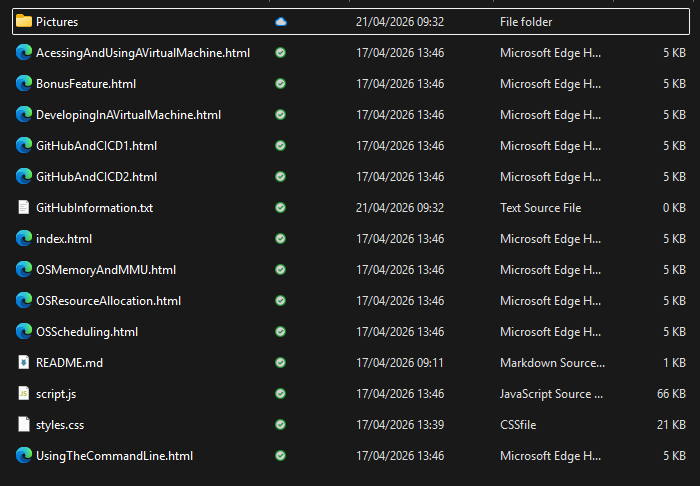
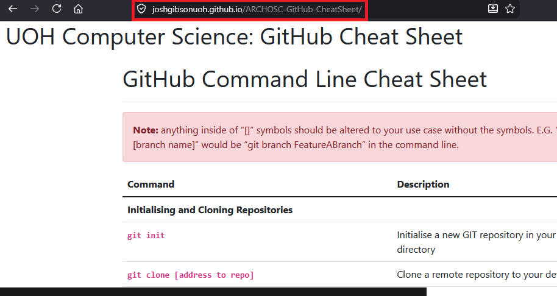
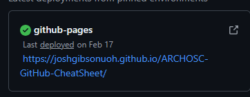
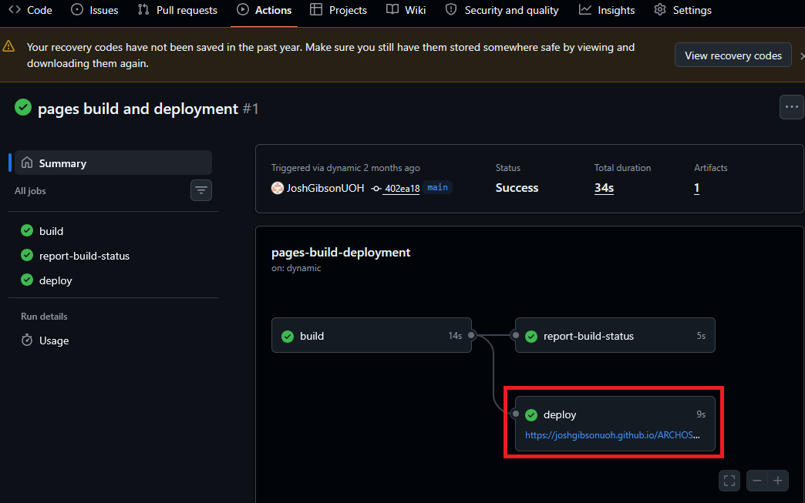
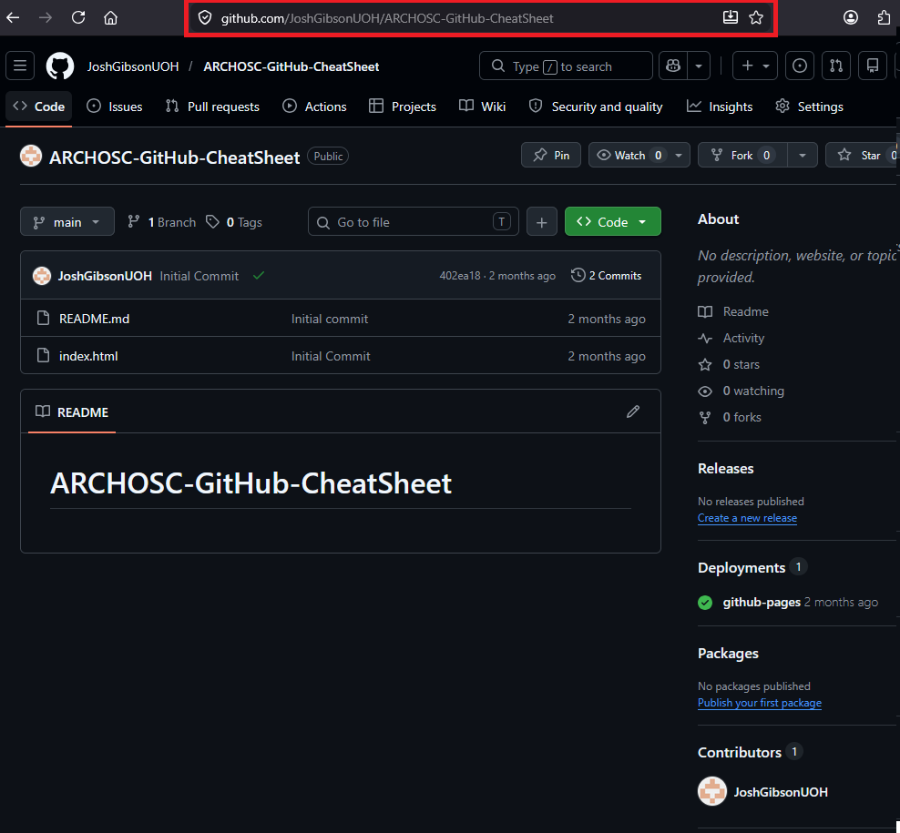

<html lang="en">
<head>
    <meta charset="UTF-8">
    <meta name="viewport" content="width=device-width, initial-scale=1.0">
    <!-- Bootstrap CSS -->
    <link href="https://stackpath.bootstrapcdn.com/bootstrap/4.5.2/css/bootstrap.min.css" rel="stylesheet">
</head>
<body>

    

    <svg xmlns="http://www.w3.org/2000/svg" width="16" height="16" fill="currentColor" class="bi bi-lightbulb" viewBox="0 0 16 16">
    <path d="M2 6a6 6 0 1 1 10.174 4.31c-.203.196-.359.4-.453.619l-.762 1.769A.5.5 0 0 1 10.5 13a.5.5 0 0 1 0 1 .5.5 0 0 1 0 1l-.224.447a1 1 0 0 1-.894.553H6.618a1 1 0 0 1-.894-.553L5.5 15a.5.5 0 0 1 0-1 .5.5 0 0 1 0-1 .5.5 0 0 1-.46-.302l-.761-1.77a2 2 0 0 0-.453-.618A5.98 5.98 0 0 1 2 6m6-5a5 5 0 0 0-3.479 8.592c.263.254.514.564.676.941L5.83 12h4.342l.632-1.467c.162-.377.413-.687.676-.941A5 5 0 0 0 8 1"/>
</svg> <strong>Note!!</strong>
Before doing <strong>any</strong> of this, you must ensure that you have completed all of your labs first. The sessions over the next two weeks should give you a chance to do this. 
    

<!-- Bootstrap JS and dependencies -->

</body>
</html>

# Architectures, Operating Systems and The Cloud: Submission Guide

## Preparing To Submit

Before you submit your completed website, you must ensure that it has the following:
- [ ] A page contraining the content from the GitHub and CICD Lab 1 including screenshots and descriptions.
- [ ] A page contraining the content from the GitHub and CICD Lab 2 including screenshots and descriptions.
(You may have decided to merge these into one lab - if this is the case that is also fine).
- [ ] A page containing the content from the Accessing and Using a Virtual Machine lab including screenshots and descriptions.
- [ ] A page containing the content from the Developing in a Virtual Machine lab including screenshots and descriptions.
(Again, You may have decided to merge these into one lab - if this is the case that is also fine).
- [ ] A page containing the content from the OS scheduling lab including screenshots, descriptions and any other outputs.
- [ ] A page containing the content from the OS Memory and MMU lab including screenshots, descriptions and any other outputs.
- [ ] A page containing the content from the Resource Allocation lab including screenshots, descriptions and any other outputs.
- [ ] (If Completed) A page containing the information on the custom feature you included, and how it was created.

## Your Submission

When all of the above is completed, and visible on your web page, your submission should include the following. 

- [ ] Your entire portfolio, as it appears in your GitHub repository.
(The easiest way of doing this, would be to create a new folder, call it submission and then clone your website into it, this way you know it is the upto date version)
- [ ] A notepad document that contains both a link to the hosted version of your website (so the one you get to from GitHub actions, and your repository.)
If either of these are missing - and I cannot find your repository - you can lose up to 20 marks!

When completed, your submission should look similar to this (Although they will likely be differences in things like filenames.)

You should then compress this into a .ZIP folder, and upload that to Canvas.

For extra clarity on where to get your GitHub links from, to get your GitHub pages link you can either open your site in the browser and copy it directly from the address bar:

Or you can take it directly from your Deployments,

Or within the GitHub Action

For the link to your repository you must be on the main page of your repository, and copy the link from the top of the page

You must ensure that it is only the main link, it should not have anything after the name of your repository - so nothing like "https://github.com/JoshGibsonUOH/ARCHOSC-GitHub-CheatSheet/blob/main/README.md", just "https://github.com/JoshGibsonUOH/ARCHOSC-GitHub-CheatSheet"
